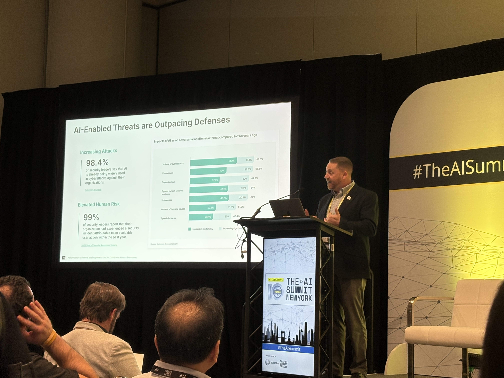

Building the AI Factory: Scaling Adoption Through Communities of Builders

## AI Adaption is not a tooling Problem

- Slow
- No Common Language
- Security as a Brake
- Isolated Silos

## Enterpirse Don't need an AI Tool, They need an AI Factory

An AI Factory is fundamentally different from a tool. It is a complete system for transforming raw ideas into production-ready AI capabilities at scale.

- Community of Builders
- Infrastructure that makes creativity cheap
- Governance that accelerates
- Top-DOwn + Bottom-up = Middle-out

## Pillar 1: Communities of Builders

- Internal AI Guilds
- Peer Learning Networks
- Show and Tell Culture
- Democratized Innovation

## Pillar 2: Governance that Accelerates

Good Governance Makes AI Faster, Not slower

- Streamlined Approvals:

Governance Flywheel

Good governance creates a self-reinforcing cycle where each element strengthens the others

Safety -> Trust -> Adaption -> Impact -> Feedback -> Safety

## Pillar 3: Infrastructure that Makes Creativity Cheap

The factory floor

Unified MLOps

### What is MLOps?

MLOps (Machine Learning Operations) is the practice of applying DevOps principles to machine learning workflows. It removes friction from idea to production.

Key Components:

- Model Training & Versioning: Reproducible, trackable workflows
- Model Serving & Deployment: Fast, reliable rollouts
- Monitoring & Feedback: Continuous model health checks
- Collaboration Tools: Shared infrastructure for all builders

Without MLOps, teams reinvent wheels. With MLOps, builders focus on innovation, not infrastructure.

## What Enterpirses get Wrong

Myths about AI Adoption

- We need more pilots

## Build your AI Factory

- Where do my builders go today to experiment safely with AI tools and models?
- What's our Factory - not just our favorite model or latest pilot project
- How are we enabling communities of builders instead of relying on lone heroes?
- Do our security and governance models accelerate

---

## 📸 Session Images

