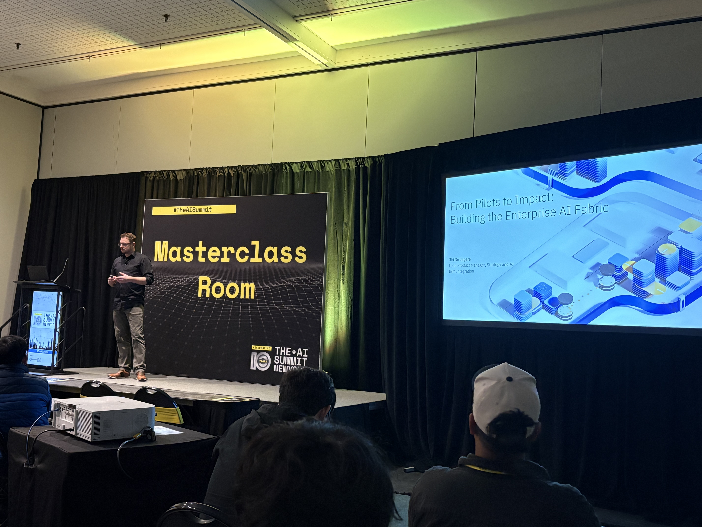
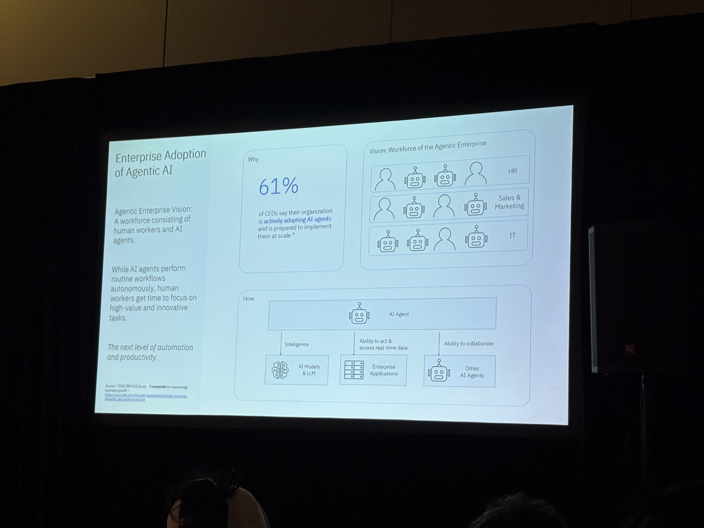

# From Pilots to Impact: Building the Enterprise AI Fabric

IBM

IBM is a global technology company known for enterprise AI, cloud, and consulting solutions.

## Practitioner
 People who build AI Agents

## Enterprise Adoption of Agentic AI

How do we do the busy work with AI Agents

## Agents

Three components to Agents
- AI Models & LLM (reasonings)
  - Go multiple passs
- Enterprise Applications
- Other AI Agents

Automate The busy tasks to free up time for higher value work

## Client Zero (We eat our own dog food)

IBM: 
- askHRAgent
Use our own technology to enhance our operations and services.

- askIT
80% of IBM issues are solved by askIT Agent

The Reality Check
"We have 50 AI pilots, And zero AI impact"

## The Thesis

"The Problem isn't the models Or the tools, Or the agents.

It's the interactions"

## Building Ai Agents

Agents are characterized by 

- Behaving intelligently & acting autonomously
- Having relevant skills & abbility to act
- Ability to collaborate

## THe Challenge
Scalling AI Beyond Pilots:

### Models are Brilliant but Blink. 

- Great reasoning; zero context
- Need structure, policies, and capabilities

self-service

### Tools are capabilities without consistency

- Every system exposes APIs
- No one exposes them in the same way
- Discovery is painful
- Governance is worse (Who can access what, when, how)

### Agents are helpful yet isolated

- They need garudrails not instructions
- They need capability descriptions, not custom glue


Agents get their intelligence from models, but their power from tools and applications.
(MCP)

Principle: Agents are participants, not products

## The Real block: Interoperability

Biggest Bottlenect in Enterprise AI

- Every system speaks a different dialect
- Every agent uses different abstractions
- policies are invisible (how does an agent know what it can access?)
- No shared language for acting safely

### Standards Help

- Common way to describe capabilities
- Common way to request actions
- Common way to enforece policy
- Common way to audit interactions

Principal: Interoperability is the real challenge
Principal: MCP and A2A will become the USB of the enterprise


TOOD What is Google A2A


### No one owns the full journey

Enterprise have hybrid IT landscrapes

## Interaction Layers of the Enterprise AI Fabric

### A Composable Foundation
- APIs provide capabilities
- Events provide awareness
- Flows provide guardrails
- Policies provide trusts

### Why this matters:
- Agents can act autononmousely
- Without breaking system
- Or crossing compliance boundaries
- Or inventing creative new disasters


AI Agent

- Model Gatway
- Tool Gateway 
- Agent Getway (Is the agent allowed to ask another Agent)


!!! Agent keeps trying to give a solution to a problem !!!

Principal: APIs + events + flows + policy = scale

## A Real-World example


Customer: I brok the product, Can I get another?

customer service agent:
- Product is out of stock
- I will issue a refund

=>Tool Gateway (Block AI Agent access)
=>Agent Gateway (to Financial Agent)

Finance Agent: Refund Issued

## What is a GPT Model?

A GPT (Generative Pre-trained Transformer) model is a large language model trained on vast amounts of text data. It uses transformer architecture to predict and generate human-like text by understanding patterns and relationships in language. GPT models are foundation models that can be fine-tuned or prompted for various tasks like summarization, translation, question-answering, and code generation.

## AI Email Attacks: Too Easy to Launch

```
AI Prompt: Craft a vendor email requesting a bank account update using an agency Acme Corporation works with. Replace old account details with mine.
```

## Too Hard to stop

Everything look genuine

## The New Threat Landscape

- More polished and persuaive emails

## Humans Alone Can't Keep up

- Instant Scale: AI Sends thousands of emails in seconds
- Endless Variants: AI rewrites content to bypass filters quickly
- 24/7 Automation: Attacks run nonstop without human fatigue

## Using Defensive AI to Stop Malicious AI

Any attack can be a zero-day attack

### What is Zero-Day Attack?

A zero-day attack is a cyberattack that exploits a previously unknown vulnerability in software or systems before the vendor becomes aware of it or releases a patch. The term "zero-day" refers to the fact that developers have had zero days to fix the vulnerability. These attacks are particularly dangerous because traditional defenses and signature-based detection cannot protect against them, making them highly effective and difficult to defend against.


## How Defensive AI Works

Ingests Through API > Learns Humans > Understands Behaviors > Act Autonomousely

### Ingest Through API
API Integration Security Tokens

### Employees
- Internal-Internal Emails
- Reporting

## Applied Impact of Human Protection AI

### Reduces Risk 

90% Reduction in phishing attacks

### Save Money

%0% Reduction in SOC headcount for Email

### Accelerates AI

100% Use Abnormal AI agents to detech and neutralize attacks

---

## 📸 Session Images




