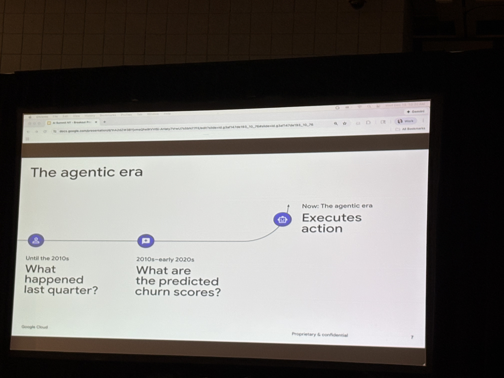
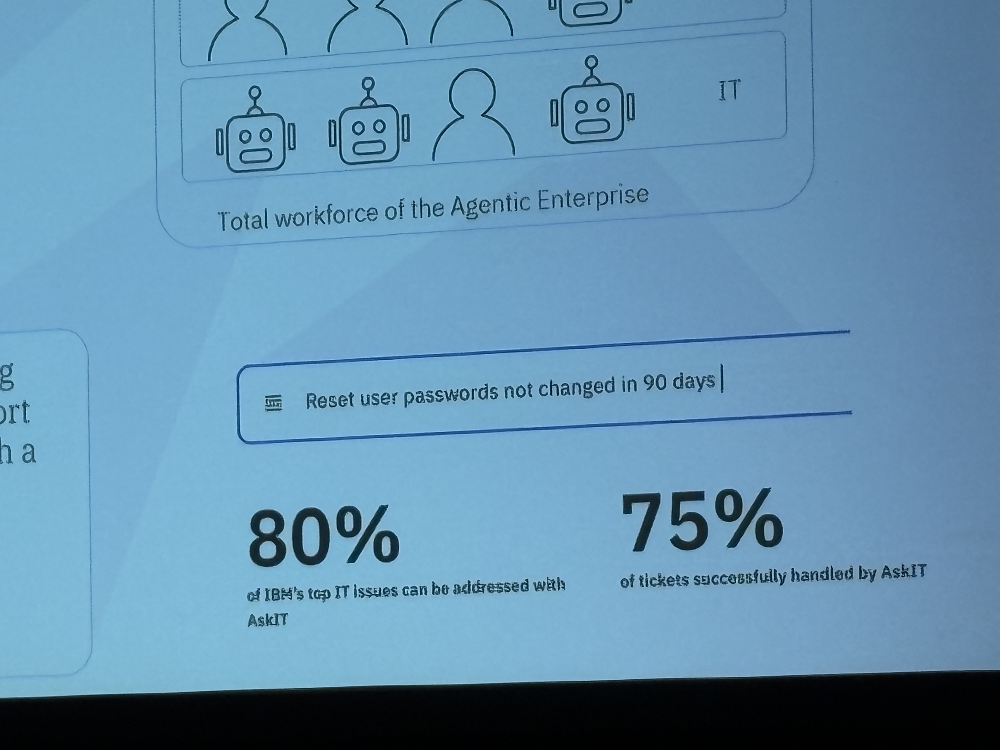

# AI Summit 2025-12 — Index

Welcome to the AI Summit session notes and summaries.

---

## 📋 Overview

- [Summit Summary](summary.md) — Comprehensive workspace summary of all sessions with key themes
- [Jia's Reflection](summit-summary.md) — Personal takeaways and experience using AI for note-taking

---

## 🎯 Sessions

### Security & Governance

- [AI in the Hot Zone: Panel Discussion](ai-in-the-hot-zone_panel/ai-in-the-hot-zone_panel.md)  
  *Securing critical infrastructure across regulated sectors*

- [AI Security Maturity Model — Mastercard](ai-security-maturity-model_mastercard/ai-security-maturity-model_mastercard.md)  
  *Deep dive into the AISMM framework*

- [AI vs. AI: The Cybersecurity Arms Race — Defense & ARM](ai-vs-ai-defence-arm-rest/ai-vs-ai-defence-arm-rest.md)  
  *Offensive and defensive AI in email attacks*

- [Breach Workshop](breach-workshop/breach-workshop.md)  
  *Incident response exercises*

### Workforce & Skills

- [Building the AI Security Workforce — NYU](building-ai-security-workforce_nyu/building-ai-security-workforce_nyu.md)  
  *From skills gap to strategic advantage*

### Enterprise Architecture & Platforms

- [Building Scalable, Governed AI Systems — Google](building-scalable-governed-ai-systems_google/building-scalable-governed-ai-systems_google.md)  
  *The Enterprise Agent Factory*

- [Building the AI Factory](building-the-ai-factory/building-the-ai-factory.md)  
  *Scaling adoption through communities of builders*

- [Building the Enterprise AI Fabric — IBM](building-the-enterprise-ai-fabric/building-the-enterprise-ai-fabric.md)  
  *From pilots to impact*

- [Transforming Data Centers into AI Factories — NVIDIA & HPE](transforming-data-centers-into-ai-factories_nvidia-hpe/transforming-data-centers-into-ai-factories_nvidia-hpe.md)  
  *Engines of enterprise intelligence*

### Production AI & Applications

- [Production-Ready GenAI — Bloomberg](production-ready-gen-ai_bloomberg/production-ready-gen-ai_bloomberg.md)  
  *Customer-facing LLM apps in data-rich enterprises*

- [Redefining Enterprise Decision Systems — University of Illinois](redefining-enterprise-decision-systems_university-of-illinois/redefining-enterprise-decision-systems_university-of-illinois.md)  
  *Neurosymbolic agents for responsible autonomy*

- [Product Matching — Staples](staples/staples.md)  
  *Multi-stage retrieval and ranking*

- [AI-Powered Support — Walmart](transforming-unstructured-data-into-live-action_walmart/transforming-unstructured-data-into-live-action_walmart.md.md)  
  *Transforming unstructured data into live action*

### Data & Privacy

- [Synthetic Data Sharing Workshop — JPMorgan](workshop_synthetic-data-sharing_jpmorgan/workshop_synthetic-data-sharing_jpmorgan.md)  
  *Privacy-preserving data sharing techniques*

### Social Impact & Public Sector

- [Human vs. Machine: Facial Recognition](human-vs-machine/human-vs-machine.md)  
  *Social impacts of AI facial recognition*

- [The Signal and the Noise — City of Seattle](the-signal-and-the-noise/the-signal-and-the-noise.md)  
  *AI's role in crisis detection and rapid response*

---

## 🔑 Key Themes

- **Governance & Interoperability**: MCP, registries, gateways are as critical as models
- **Safety + Relevance**: Guardrails must cover both dimensions
- **Workforce Evolution**: AI-augmented analysts with deliberate upskilling
- **Data Quality**: Semantic layers and unified data planes underpin trust
- **Multi-Agent Systems**: Moving beyond single models to orchestrated platforms

---

## 📸 Additional Summit Photos

---

*Generated by GitHub Copilot · December 2025*
